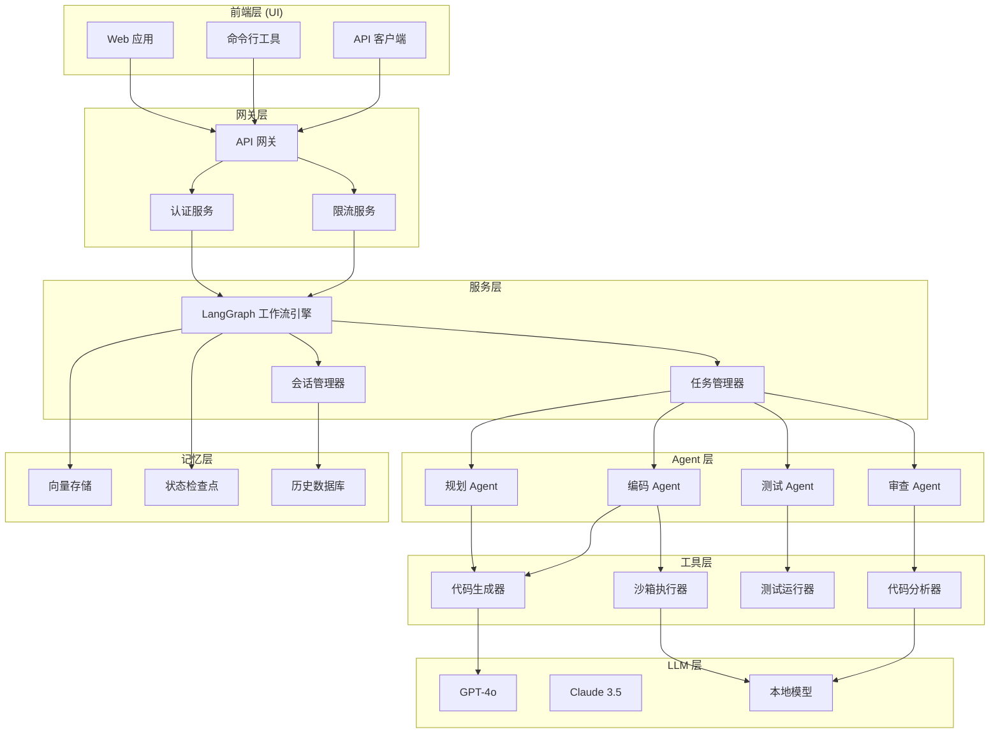
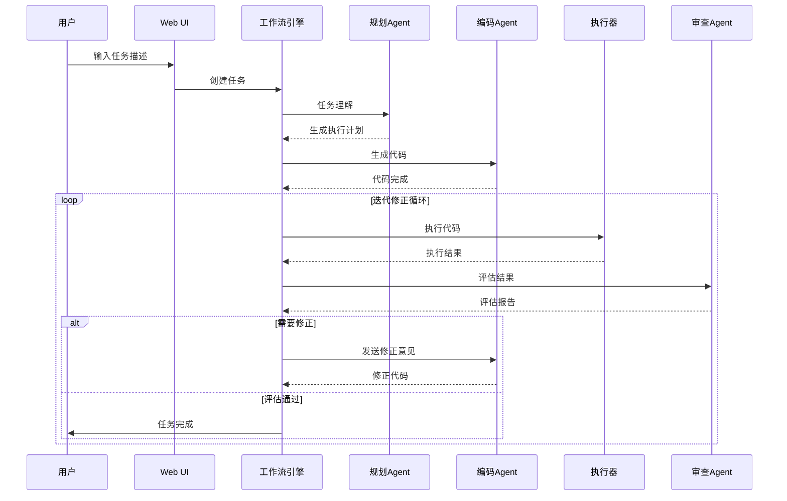

# 自进化编程助手（SelfEvolve Code Agent）

## 产品需求文档 v1.0

| 文档信息 | 内容 |
|---------|------|
| 产品名称 | SelfEvolve Code Agent |
| 产品版本 | v1.0 |
| 文档日期 | 2026-04-15 |
| 产品负责人 | AI Engineering Team |
| 文档状态 | 初稿 |

---

## 1. 产品概述

### 1.1 产品背景

随着大语言模型（LLM）技术的快速发展，AI 辅助编程已从简单的代码补全演进到能够执行复杂编程任务的新阶段。传统的 AI 编程工具（如 GitHub Copilot）主要聚焦于单点代码生成，无法独立完成完整的软件开发流程。市场上对于能够自主理解高层需求、执行代码、验证结果并进行自我修正的智能化编程系统存在强烈需求。

基于对 LangChain 和 LangGraph 框架的深入调研，我们发现这些技术为构建自进化编程系统提供了坚实的技术基础。LangGraph 的图结构支持循环和状态管理，能够完美表达"执行→评估→修正"的迭代工作流，是实现自进化能力的理想选择。

### 1.2 产品定义

**SelfEvolve Code Agent** 是一款基于大语言模型和 LangGraph 工作流引擎构建的智能编程助手，能够接收自然语言描述的开发任务，自主完成需求分析、代码生成、执行验证、结果评估和自我修正的全流程工作，最终交付满足要求的可运行代码。

### 1.3 核心价值主张

| 价值维度 | 描述 |
|---------|------|
| **效率提升** | 将重复性编程任务自动化，让开发者聚焦于更具创造性的工作 |
| **质量保障** | 通过自动测试和评估机制，确保代码质量 |
| **自我进化** | 具备反思和修正能力，能够从错误中学习并持续改进 |
| **降低门槛** | 帮助非专业开发者实现复杂的编程需求 |

### 1.4 与现有产品的差异

| 特性 | 传统 IDE 插件 | 通用 ChatGPT | SelfEvolve Code Agent |
|------|--------------|-------------|----------------------|
| 交互模式 | 被动补全 | 对话式 | 自主执行闭环 |
| 代码执行 | ❌ | ❌ | ✅ |
| 自动测试 | ❌ | ❌ | ✅ |
| 自我修正 | ❌ | 有限 | ✅ |
| 多轮迭代 | ❌ | 依赖用户 | ✅ 全自动 |
| 任务持久化 | ❌ | ❌ | ✅ |

---

## 2. 目标用户与使用场景

### 2.1 目标用户画像

**用户群体 A：全栈开发者**
- 特征：有一定编程基础，需要快速完成功能开发
- 痛点：重复性代码编写耗时，测试用例编写繁琐
- 需求：快速生成代码骨架和测试用例

**用户群体 B：技术管理者**
- 特征：关注开发效率和技术债务
- 痛点：项目进度难以追踪，代码质量不稳定
- 需求：自动化代码审查和质量监控

**用户群体 C：学习者/非技术人员**
- 特征：编程经验有限，需要学习指导
- 痛点：不知从何入手，容易遇到困难卡住
- 需求：获得逐步指导，降低学习门槛

### 2.2 典型使用场景

**场景一：快速原型开发**
用户输入一个功能需求，系统自动完成从项目结构创建到功能验证的全流程。

**场景二：代码修复与优化**
用户指出代码问题，系统自动分析问题原因并实施修正方案。

**场景三：测试用例自动生成**
用户指定代码模块，系统自动生成高覆盖率的单元测试。

**场景四：技术调研与方案设计**
用户提出技术问题，系统进行调研并生成可运行的示例代码。

---

## 3. 功能需求

### 3.1 功能优先级矩阵

| 功能模块 | P0（核心） | P1（重要） | P2（增强） |
|---------|----------|----------|----------|
| 任务理解与规划 | ✅ | | |
| 代码生成 | ✅ | | |
| 代码执行与验证 | ✅ | | |
| 结果评估与反馈 | ✅ | | |
| 自我修正 | ✅ | | |
| 多轮迭代控制 | ✅ | | |
| 任务持久化 | | ✅ | |
| 多 Agent 协作 | | ✅ | |
| 记忆系统 | | ✅ | |
| Web UI 界面 | | ✅ | |
| API 服务接口 | | | ✅ |
| IDE 插件集成 | | | ✅ |
| 团队协作功能 | | | ✅ |

### 3.2 核心功能详细说明

#### 3.2.1 任务理解与规划（P0）

**功能描述**

系统接收用户使用自然语言描述的任务需求，通过 LLM 进行意图理解和任务分解，生成可执行的详细工作计划。

**用户交互流程**

```
用户输入 → 意图识别 → 需求澄清（如需要）→ 任务分解 → 计划生成 → 用户确认
```

**验收标准**
- [ ] 能够正确理解 90% 以上的常见编程任务
- [ ] 任务分解逻辑清晰，子任务之间依赖关系正确
- [ ] 对于模糊需求，系统能够主动提问澄清
- [ ] 计划生成时间 < 10秒

#### 3.2.2 代码生成（P0）

**功能描述**

根据任务计划，系统自动生成符合要求的代码文件。支持多种编程语言和框架，遵循最佳实践和编码规范。

**支持的语言和框架**

| 类别 | 支持范围 |
|------|---------|
| 前端 | JavaScript, TypeScript, React, Vue |
| 后端 | Python (FastAPI, Django, Flask), Node.js, Java Spring |
| 数据处理 | Python (Pandas, NumPy) |
| 数据库 | SQL, MongoDB |
| DevOps | Dockerfile, Docker Compose, Shell |

**验收标准**
- [ ] 代码语法正确，能够被解释器/编译器接受
- [ ] 代码符合所选框架的最佳实践
- [ ] 包含必要的注释和文档

#### 3.2.3 代码执行与验证（P0）

**功能描述**

系统将生成的代码写入沙箱环境，执行代码并收集执行结果。执行过程被严格隔离，确保系统安全。

**安全机制**
- 沙箱隔离执行环境（Docker 容器）
- 执行超时控制（默认 60 秒）
- 资源使用限制（CPU、内存、网络）
- 危险操作拦截

**验收标准**
- [ ] 所有代码执行在隔离环境中进行
- [ ] 超时机制正常工作
- [ ] 资源限制有效防止恶意代码

#### 3.2.4 结果评估与反馈（P0）

**功能描述**

系统对代码执行结果进行多维度评估，生成详细的评估报告。

**评估维度**

| 维度 | 评估内容 | 权重 |
|------|---------|------|
| 功能正确性 | 代码是否实现了预期功能 | 40% |
| 执行通过率 | 代码是否成功运行无报错 | 30% |
| 代码质量 | 是否遵循最佳实践 | 15% |
| 性能表现 | 执行时间和资源消耗 | 10% |
| 安全合规 | 是否存在安全隐患 | 5% |

**验收标准**
- [ ] 评估结论与实际情况一致率 > 85%
- [ ] 问题识别准确，避免误报
- [ ] 改进建议具有可操作性

#### 3.2.5 自我修正（P0）

**功能描述**

当评估发现问题时，系统自动分析问题原因，生成修正方案，执行修正操作，并再次验证。

**修正策略**

| 问题类型 | 修正策略 |
|---------|---------|
| 语法错误 | 修正语法，重新执行 |
| 逻辑错误 | 分析原因，重新实现相关逻辑 |
| 测试失败 | 检查预期与实际的差异，调整代码 |
| 性能问题 | 识别瓶颈，应用优化方案 |
| 安全问题 | 识别风险点，实施安全加固 |

**迭代控制**
- 最大迭代次数：5 次
- 收敛检测：连续 2 次迭代无改进则提前终止
- 改进阈值：每次迭代必须有可度量的改进

**验收标准**
- [ ] 能够自动修复 70% 以上的常见代码错误
- [ ] 修正过程不引入新的问题

#### 3.2.6 多 Agent 协作（P1）

**功能描述**

系统采用多 Agent 架构，不同 Agent 负责不同职责，通过协作完成复杂任务。

| Agent | 职责 |
|-------|------|
| 规划 Agent | 理解需求，分解任务，制定计划 |
| 编码 Agent | 生成代码，处理代码修改 |
| 测试 Agent | 编写测试用例，执行测试 |
| 审查 Agent | 代码审查，评估质量，提出改进建议 |

**验收标准**
- [ ] 多 Agent 能够有效协作
- [ ] 任务分解合理，各 Agent 职责清晰

#### 3.2.7 记忆系统（P1）

**功能描述**

系统具备长期记忆能力，能够从历史任务中学习，改善未来任务的表现。

**记忆类型**

| 记忆类型 | 存储内容 | 保留时间 |
|---------|---------|---------|
| 对话记忆 | 当前会话的对话历史 | 会话期间 |
| 任务记忆 | 历史任务和解决方案 | 长期 |
| 领域知识 | 特定领域的技术知识 | 长期 |
| 用户偏好 | 用户的编码风格偏好 | 长期 |

**验收标准**
- [ ] 记忆能够正确存储和检索
- [ ] 检索结果相关性 > 70%

#### 3.2.8 任务持久化（P1）

**功能描述**

支持长时间运行任务的持久化，包括状态保存、断点恢复、会话管理等功能。

**验收标准**
- [ ] 系统重启后任务状态可恢复
- [ ] 支持查看历史任务

---

## 4. 非功能需求

### 4.1 性能指标

| 指标 | 目标值 | 说明 |
|------|--------|------|
| 任务理解时间 | < 10s | 从输入到生成计划 |
| 代码生成时间 | < 30s | 单个文件的生成时间 |
| 代码执行时间 | < 60s | 单次执行的超时限制 |
| 系统响应时间 | < 2s | 界面操作的响应 |
| 并发任务数 | 5 个 | 支持同时执行的任务数 |

### 4.2 可用性要求

| 指标 | 目标值 |
|------|--------|
| 系统可用性 | 99.5% |
| 任务成功率 | > 90% |
| 平均无故障时间 | > 720 小时 |
| 故障恢复时间 | < 30 分钟 |

### 4.3 安全性要求

| 安全措施 | 要求 |
|---------|------|
| 沙箱隔离 | 所有代码执行必须在隔离环境中 |
| 权限控制 | 最小权限原则，限制文件访问 |
| 输入验证 | 所有用户输入必须验证和清理 |
| 操作审计 | 记录所有敏感操作 |
| 数据加密 | 敏感数据传输使用加密 |

---

## 5. 技术架构

### 5.1 系统架构图



### 5.2 核心组件说明

| 组件 | 技术选型 | 说明 |
|------|---------|------|
| 工作流引擎 | LangGraph | 基于状态图的工作流编排 |
| LLM 接入 | LangChain | 支持多模型统一接入 |
| 代码执行 | Docker + Python | 沙箱隔离执行环境 |
| 向量存储 | Chroma / Qdrant | 记忆系统向量检索 |
| 状态持久化 | PostgreSQL + Redis | 任务状态和缓存 |
| 前端框架 | React + Ant Design | Web UI |
| 后端框架 | FastAPI | API 服务 |

### 5.3 数据模型

**任务状态（TaskState）**

```python
class TaskState(BaseModel):
    task_id: str                    # 任务唯一标识
    description: str                # 任务描述
    status: TaskStatus              # 状态枚举
    current_step: str               # 当前执行步骤
    iterations: int                 # 当前迭代次数
    max_iterations: int = 5         # 最大迭代次数
    code_files: dict[str, str]       # 代码文件映射
    execution_results: list[ExecutionResult]  # 执行结果
    test_results: TestSummary       # 测试结果摘要
    assessment: AssessmentResult    # 评估结果
    created_at: datetime            # 创建时间
    updated_at: datetime             # 更新时间
    user_id: str                    # 用户标识
```

**会话状态（SessionState）**

```python
class SessionState(BaseModel):
    session_id: str                 # 会话唯一标识
    user_id: str                    # 用户标识
    tasks: list[str]                # 关联任务列表
    memory_context: str             # 记忆上下文
    preferences: UserPreferences    # 用户偏好
    created_at: datetime
    last_active_at: datetime
```

### 5.4 API 接口设计

**任务管理接口**

| 接口 | 方法 | 说明 |
|------|------|------|
| /api/v1/tasks | POST | 创建新任务 |
| /api/v1/tasks | GET | 获取任务列表 |
| /api/v1/tasks/{id} | GET | 获取任务详情 |
| /api/v1/tasks/{id} | DELETE | 删除任务 |
| /api/v1/tasks/{id}/cancel | POST | 取消任务 |
| /api/v1/tasks/{id}/resume | POST | 恢复任务 |

**会话管理接口**

| 接口 | 方法 | 说明 |
|------|------|------|
| /api/v1/sessions | POST | 创建会话 |
| /api/v1/sessions/{id} | GET | 获取会话详情 |
| /api/v1/sessions/{id}/messages | GET | 获取会话消息 |

**代码操作接口**

| 接口 | 方法 | 说明 |
|------|------|------|
| /api/v1/tasks/{id}/files | GET | 获取代码文件列表 |
| /api/v1/tasks/{id}/files/{path} | GET | 获取文件内容 |
| /api/v1/tasks/{id}/files/{path} | PUT | 更新文件内容 |

---

## 6. 用户流程

### 6.1 主流程



### 6.2 详细流程说明

**步骤 1：任务提交**

1. 用户在输入框中描述编程任务
2. 系统进行基础验证（非空、长度限制）
3. 生成任务 ID，创建任务记录
4. 返回任务状态给用户

**步骤 2：任务理解**

1. 规划 Agent 接收任务描述
2. 进行意图识别和实体提取
3. 判断是否需要补充信息
4. 如需澄清，生成问题返回用户
5. 如信息充足，生成执行计划

**步骤 3：代码生成**

1. 编码 Agent 读取执行计划
2. 分析需要创建/修改的文件
3. 按依赖顺序生成代码
4. 同步更新文件系统状态
5. 记录代码变更历史

**步骤 4：执行验证**

1. 将代码写入沙箱环境
2. 安装依赖包
3. 执行代码并捕获输出
4. 运行单元测试
5. 收集执行指标

**步骤 5：结果评估**

1. 审查 Agent 接收执行结果
2. 对比预期与实际输出
3. 分析测试用例通过情况
4. 检查代码质量指标
5. 生成评估报告

**步骤 6：自我修正（如需要）**

1. 分析评估发现的问题
2. 生成修正方案
3. 执行代码修改
4. 重新执行验证
5. 判断是否达到收敛条件

**步骤 7：任务完成**

1. 汇总所有生成的文件
2. 生成任务总结报告
3. 更新记忆系统
4. 通知用户任务完成
5. 提供代码下载/查看链接

---

## 7. 里程碑计划

### 7.1 版本规划


### 7.1 版本规划

| 版本 | 里程碑日期 | 交付内容 |
|------|----------|---------|
| v0.1 MVP | 2026-05-15 | 单 Agent 架构、基础代码生成和执行、Web UI alpha |
| v0.5 Beta | 2026-06-30 | 多 Agent 协作、迭代修正机制、CLI 工具 |
| v0.9 RC | 2026-08-15 | 记忆系统、任务持久化、性能优化 |
| v1.0 GA | 2026-09-30 | API 服务、监控告警、正式发布 |

### 7.2 MVP 版本详细计划

**MVP 范围定义**

MVP (Minimum Viable Product) 聚焦于验证核心价值主张，交付最小可用功能集。

| 功能 | 描述 | 工作量 |
|------|------|--------|
| 单 Agent 架构 | 基础的单 Agent 处理任务 | 3 周 |
| 任务理解 | LLM 理解自然语言任务 | 1 周 |
| 代码生成 | 生成 Python/JS 代码 | 2 周 |
| 沙箱执行 | Docker 隔离执行 | 2 周 |
| 结果评估 | 执行结果分析 | 1 周 |
| Web UI | 基础界面 | 2 周 |
| 集成测试 | 端到端测试 | 1 周 |

**总工期：8 周**

### 7.3 Beta 版本详细计划

| 功能 | 描述 | 工作量 |
|------|------|--------|
| 多 Agent 架构 | 规划、编码、测试、审查 Agent | 3 周 |
| 迭代修正 | 自我修正机制 | 2 周 |
| 收敛控制 | 迭代次数和收敛检测 | 1 周 |
| CLI 工具 | 命令行界面 | 1 周 |
| 状态持久化 | PostgreSQL 存储 | 2 周 |
| 性能优化 | 缓存、并发优化 | 1 周 |

**总工期：10 周**

---

## 8. 风险评估与应对

### 8.1 技术风险

| 风险 | 概率 | 影响 | 应对策略 |
|------|------|------|---------|
| LLM 幻觉导致错误代码 | 高 | 高 | 多层验证：语法检查、单元测试、执行验证 |
| 沙箱安全漏洞 | 中 | 高 | 定期安全审计、资源限制、监控告警 |
| 上下文窗口耗尽 | 中 | 中 | 状态压缩、摘要生成、任务分解 |
| 执行超时频繁 | 中 | 中 | 异步执行、增量处理、超时优化 |
| 多 Agent 协作死锁 | 低 | 中 | 超时机制、人工干预入口 |

### 8.2 产品风险

| 风险 | 概率 | 影响 | 应对策略 |
|------|------|------|---------|
| 用户期望过高 | 高 | 中 | 明确产品边界、管理期望、渐进承诺 |
| 任务理解偏差 | 中 | 中 | 主动澄清机制、用户确认流程 |
| 复杂任务处理失败 | 中 | 中 | 任务复杂度评估、主动降级 |

### 8.3 运营风险

| 风险 | 概率 | 影响 | 应对策略 |
|------|------|------|---------|
| LLM API 成本超支 | 中 | 中 | 用量监控、成本控制、缓存优化 |
| 服务稳定性问题 | 低 | 高 | 多区域部署、故障转移、熔断机制 |
| 用户数据泄露 | 低 | 高 | 数据加密、访问控制、审计日志 |

---

## 9. 成功指标

### 9.1 产品指标

| 指标 | 目标值 | 测量方法 |
|------|--------|---------|
| 任务完成率 | > 90% | 成功任务数 / 总任务数 |
| 用户满意度 | > 4.0/5.0 | 用户调研评分 |
| 代码正确率 | > 85% | 执行无错误的任务比例 |
| 平均修复次数 | < 2 次 | 单任务平均迭代次数 |

### 9.2 技术指标

| 指标 | 目标值 | 测量方法 |
|------|--------|---------|
| 系统可用性 | 99.5% | 正常运行时间比例 |
| 平均响应时间 | < 5s | API 响应时间 P95 |
| 错误率 | < 1% | 错误请求 / 总请求 |
| 并发能力 | 10 用户 | 同时在线用户数 |

### 9.3 商业指标

| 指标 | 目标值 | 测量方法 |
|------|--------|---------|
| 日活跃用户 | > 100 | DAU 统计 |
| 用户留存率 | > 60% | 7 日留存 |
| 功能使用率 | > 70% | 核心功能使用比例 |
| 付费转化率 | > 5% | 免费到付费转化 |

---

## 10. 附录

### 10.1 术语表

| 术语 | 定义 |
|------|------|
| 自进化 | 系统具备自我评估、反馈、修正的能力，能够从经验中学习 |
| Agent | 智能代理，能够自主决策和执行任务的软件实体 |
| 沙箱 | 隔离的运行环境，用于安全执行不受信任的代码 |
| 思维链 (CoT) | 一种提示技术，引导 LLM 进行分步推理 |
| 检查点 | 任务执行过程中的状态快照，用于恢复和回溯 |

### 10.2 参考资料

| 参考 | 链接 |
|------|------|
| LangChain 官方文档 | https://python.langchain.com/docs |
| LangGraph 官方文档 | https://langchain-ai.github.io/langgraph/ |
| DeerFlow 开源项目 | https://github.com/bytedance/deer-flow |
| AutoGPT 项目 | https://github.com/Significant-Gravitas/AutoGPT |

### 10.3 评审记录

| 版本 | 日期 | 评审人 | 评审意见 |
|------|------|--------|---------|
| v1.0 | 2026-04-15 | - | 初稿完成 |

---

**文档结束**
