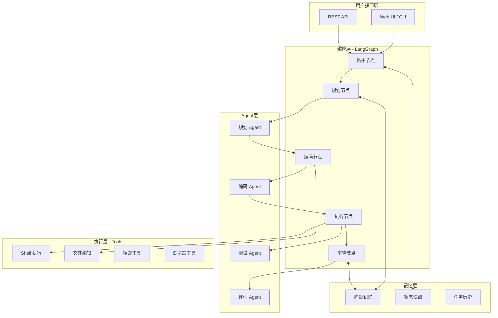

# 基于 LangChain 与 LangGraph 的自进化编程系统技术调研报告

## 摘要

本报告深入调研了基于 LangChain 和 LangGraph 框架构建自进化编程系统的技术路径与最佳实践。自进化编程系统代表了人工智能辅助软件开发的下一阶段演进方向，其核心理念是构建能够自主理解任务、执行代码、自我评估结果、持续优化迭代的智能编程代理。本报告从技术架构、核心组件、实现方案等维度进行全面分析，为开发团队提供详尽的技术参考与实践指南。

---

## 第一部分：技术基础与框架概述

### 1.1 LangChain 核心概念解析

LangChain 是一个专为构建大语言模型应用而设计的开源框架，其设计哲学围绕“链式调用”和“模块化组合”展开。框架提供了丰富的基础组件，使开发者能够快速构建复杂的 LLM 应用场景。

LangChain 的核心架构由六大模块组成，形成了一个完整的应用开发生态系统。首先是 **Model I/O 层**，负责管理与 LLM 的交互，包括模型选择、提示词模板化、输出解析等关键功能。Model I/O 层的设计强调提示词的可复用性和结构化，通过 `PromptTemplate` 类实现动态提示词构建，支持变量注入和条件逻辑。其次是 **Retrieval 层**，专注于增强生成（RAG）场景，提供了文档加载、文本分割、向量存储、相似度检索等全套工具，使 LLM 能够访问外部知识库。在 **Chains 层**，LangChain 将多个组件串联成有序的执行管道，支持顺序执行、条件分支、并行处理等复杂逻辑模式。**Agents 层**是 LangChain 的核心创新之一，它允许 LLM 自主决定采取何种行动，通过工具调用实现与外部世界的交互。Agent 的决策过程由 LLM 本身驱动，根据当前状态和可用工具动态选择下一步操作。**Memory 层**提供了多种记忆存储方案，包括对话历史、实体记忆、会话摘要等，使应用能够维护跨轮次的上下文。最后，**Tools 层**定义了 Agent 可调用的外部能力，如搜索、计算、代码执行等，是实现复杂任务的关键基础设施。

在工具调用机制方面，LangChain 支持两种主要范式：**Action Agents** 和 **Plan-And-Execute Agents**。Action Agents 在每一步都基于当前观察决定单个行动，适合短序列任务。Plan-And-Execute Agents 则先制定完整计划，再逐步执行，更适合需要长期规划的复杂任务。LangChain 还引入了 **ReAct**（Reasoning + Acting）模式，让 Agent 能够显式地进行推理并将推理过程纳入决策，这大大提升了 Agent 在复杂任务中的表现。

LangChain 的最新版本在 2025-2026 年间持续演进，新增了对多模态模型的支持，改进了流式输出处理，增强了调试和追踪能力，并引入了更细粒度的错误处理机制。框架还加强了与各大云服务商的集成，提供了更完善的部署方案。在性能优化方面，LangChain 通过异步支持、批处理、缓存优化等技术显著提升了大规模应用的吞吐能力。

### 1.2 LangGraph 核心概念解析

LangGraph 是 LangChain 团队推出的下一代应用构建框架，其核心创新在于将应用逻辑建模为**有状态的有向图**。与传统的链式调用不同，LangGraph 允许应用包含循环结构，这使得构建真正具有复杂推理能力的 Agent 成为可能。

LangGraph 的架构设计围绕三个核心概念展开：**节点（Node）**、**边（Edge）** 和 **状态（State）**。节点代表图中的处理单元，可以是 LLM 调用、工具执行、条件判断或任何自定义函数。每个节点接收当前状态，执行相应操作，然后返回更新后的状态。边定义了节点之间的连接关系，支持三种类型：普通边（无条件转移）、条件边（基于状态动态选择下一节点）和 START/END 特殊节点。这种设计使得复杂的工作流可以被清晰地可视化和精确地表达。

**状态管理**是 LangGraph 的核心特性之一。与 LangChain 的 Chain 不同，LangGraph 的每个节点都运行在一个共享的状态对象上。这个状态对象是一个 Python 字典，可以包含任意定义的字段，如对话历史、当前任务进度、代码片段、错误记录等。状态通过 **Reducer 函数**进行更新，不同的字段可以使用不同的合并策略。例如，`messages` 字段通常使用追加策略，而 `task_status` 字段则使用覆盖策略。这种灵活的状态管理机制使得构建多轮对话、多阶段任务变得直观且易于维护。

LangGraph 的**图构建 API** 提供了两种风格：声明式 API 和命令式 API。声明式 API 使用 `add_edge` 和 `add_node` 方法构建图结构，适合静态的、可预定义的工作流。命令式 API 使用 `goto` 语句在节点函数内部控制流程跳转，适合需要动态决策的场景。两种风格可以混合使用，为开发者提供了最大的灵活性。

LangGraph 特别适合构建 **Multi-Agent 系统**。通过为不同的 Agent 创建独立的节点，可以实现 Agent 间的协作与通信。每个 Agent 可以维护自己的状态子集，通过精心设计的状态流转机制实现信息共享和任务分解。这种架构天然支持复杂任务的分解执行，主 Agent 可以将任务分配给专业化的子 Agent，最后汇总结果。

在持久化方面，LangGraph 提供了强大的检查点（Checkpointing）机制。每个状态快照都可以被保存和恢复，这使得支持长时间运行的任务、任务暂停与恢复、以及多轮对话的上下文恢复成为可能。检查点机制还为实现 Human-in-the-Loop 提供了基础，允许人类在关键决策点介入并指导 Agent 的行为。

### 1.3 LangChain 与 LangGraph 的关系与演进

理解 LangChain 与 LangGraph 的关系对于选择合适的技术栈至关重要。两者的设计目标存在本质差异：LangChain 的 Chain 范式适合构建线性的、可组合的应用管道，而 LangGraph 的图范式则适合构建具有复杂控制流、需要状态持久化的应用系统。

从技术演进的角度看，LangChain 可以被视为 LangGraph 的一个特例——没有循环的图。在实际应用中，两者经常结合使用：LangChain 提供的丰富组件（Tools、Callbacks、Output Parsers 等）可以无缝集成到 LangGraph 的节点中。这种组合方式既利用了 LangGraph 的图结构表达能力，又保留了 LangChain 生态系统的丰富组件。

对于自进化编程系统而言，LangGraph 的循环支持和状态管理能力是必需的。传统的 Chain 结构无法表达“执行→评估→修正→再执行”这样的迭代模式，而 LangGraph 通过图的循环结构完美地支持了这种工作流。同时，LangGraph 的检查点机制对于实现任务的持久化和恢复、支持的长时间运行至关重要。

---

## 第二部分：自进化编程系统概念与架构

### 2.1 自进化系统的定义与特征

**自进化编程系统**（Self-Evolving Programming System）是一类能够自主完成软件开发全流程的智能系统。与传统的代码补全工具或聊天式编程助手不同，自进化系统的核心特征在于其闭环能力：能够接收高层任务描述、自主规划实现方案、执行代码、验证结果、发现问题、自我修正，并持续优化直到任务完成或达到预设质量标准。

自进化系统的核心特征可以归纳为以下几个方面。**自主性**是首要特征，系统能够在最小人工干预的情况下完成完整任务。给定一个功能需求，系统能够自主进行技术调研、方案设计、代码编写、测试验证等全流程工作。**反思能力**是区分初级 AI 编程工具与自进化系统的关键标志。自进化系统能够对执行结果进行评估，判断是否符合预期，识别潜在问题，并据此调整后续行动。这种反思能力通常通过显式的评估节点和条件判断来实现。**持续学习**能力使系统能够从历史任务中积累经验，改善自身表现。这可能表现为更新内部知识库、优化提示词模板、记住成功的解决方案等。**鲁棒性**是工程化的必要条件，自进化系统需要能够处理执行过程中的各种异常情况，包括代码执行失败、外部依赖缺失、网络问题等，并能够从中恢复或优雅降级。

### 2.2 自进化系统的架构设计模式

构建自进化编程系统通常采用**分层架构**设计，从底层到顶层依次包括：执行层、Agent 层、编排层和接口层。

**执行层**是系统与外部世界交互的基础，负责实际执行代码、调用工具、处理文件系统操作等。在实现上，执行层通常封装为一个或多个工具（Tools），供上层 Agent 调用。执行层需要处理超时控制、错误捕获、资源隔离等安全相关问题。对于代码执行，推荐使用隔离的沙箱环境，防止恶意代码影响系统安全。

**Agent 层**是系统的核心智能组件，包含一个或多个专门化的 Agent。典型的自进化系统会包含：规划 Agent 负责理解任务、分解子任务、制定执行计划；编码 Agent 负责生成代码、处理代码修改；测试 Agent 负责编写和执行测试用例、验证功能正确性；审查 Agent 负责代码审查、提出优化建议。各 Agent 通过共享状态进行协作，形成一个有机整体。

**编排层**负责协调各 Agent 的工作流程，使用 LangGraph 的图结构来表达任务执行的流程控制。编排层定义了何时激活哪个 Agent、如何处理 Agent 间的信息流转、如何处理异常和回退等逻辑。这一层是实现自进化行为的关键所在，通过精心设计的状态流转逻辑，实现“执行→评估→修正”的闭环控制。

**接口层**负责与用户交互，包括接收任务描述、展示执行进度、请求用户确认、返回最终结果等。接口层的设计直接影响用户体验，需要在自动化程度和用户控制之间取得平衡。

### 2.3 关键技术要素

实现一个功能完善的自进化编程系统需要解决多个技术挑战。

**代码生成与优化**是系统的核心能力。高质量的代码生成依赖于精心设计的提示词工程，包括清晰的指令、适当的上下文示例、明确的输出格式要求等。对于复杂任务，可以采用**思维链**（Chain-of-Thought）技术，引导 LLM 进行分步推理。代码优化则需要系统能够识别代码中的性能问题、安全隐患、可读性问题等，并提出改进建议。

**执行反馈循环**是实现自我修正能力的关键。系统需要能够捕获代码执行的结果，包括标准输出、错误信息、执行时间、资源使用等，并将这些信息反馈给 LLM 以指导后续决策。反馈信息的结构化程度直接影响 LLM 的理解和决策质量。建议将原始输出转换为结构化的分析报告，包含成功/失败状态、错误类型、相关代码片段等。

**测试驱动开发**（Test-Driven Development）模式在自进化系统中尤为重要。系统应该能够自动生成测试用例，覆盖关键功能路径，并在代码修改后自动运行测试验证。这种模式能够及早发现问题，确保修改不会破坏已有功能。

**版本控制和变更追踪**使系统能够管理代码的演进历史，包括记录每次修改的原因、对比不同版本的差异、回滚到指定版本等。这为调试和问题定位提供了有力支持。

---

## 第三部分：基于 LangChain 和 LangGraph 的实现方案

### 3.1 核心架构设计

基于 LangChain 和 LangGraph 构建的自进化编程系统架构可以设计如下：



### 3.2 状态定义

状态设计是 LangGraph 应用的核心。以下是一个适用于自进化编程系统的状态定义：

```python
from typing import TypedDict, List, Optional, Literal
from pydantic import BaseModel, Field
from langchain_core.messages import BaseMessage, AIMessage, HumanMessage

class TaskInfo(BaseModel):
    """任务信息"""
    id: str
    description: str
    requirements: List[str]
    constraints: List[str] = []
    
class CodeState(BaseModel):
    """代码状态"""
    files: dict[str, str] = Field(default_factory=dict)
    current_file: Optional[str] = None
    
class TestState(BaseModel):
    """测试状态"""
    test_cases: List[str] = []
    passed: List[str] = []
    failed: List[str] = []
    
class ExecutionResult(BaseModel):
    """执行结果"""
    success: bool
    output: str
    error: Optional[str] = None
    execution_time: float = 0

class AgentState(TypedDict):
    """自进化系统主状态"""
    # 对话历史
    messages: List[BaseMessage]
    
    # 任务信息
    task: TaskInfo
    
    # 代码相关
    code: CodeState
    edit_history: List[dict]
    
    # 执行相关
    execution_results: List[ExecutionResult]
    current_execution: Optional[ExecutionResult]
    
    # 测试相关
    tests: TestState
    
    # 工作流控制
    current_step: str
    next_steps: List[str]
    iterations: int
    max_iterations: int
    
    # 反馈与评估
    feedback: str
    needs_revision: bool
    
    # 错误处理
    errors: List[str]
    retry_count: int
```

### 3.3 节点实现

#### 3.3.1 规划节点

规划节点负责理解用户需求并制定执行计划：

```python
from langchain_openai import ChatOpenAI
from langchain_core.prompts import ChatPromptTemplate
from langgraph.graph import StateGraph, END

llm = ChatOpenAI(model="gpt-4o", temperature=0)

planning_prompt = ChatPromptTemplate.from_messages([
    ("system", """你是一个专业的软件架构师，负责制定实现计划。
    
    当前任务：{task_description}
    
    请分析任务需求，制定详细的实现计划，包括：
    1. 需要创建/修改的文件列表
    2. 实现步骤的先后顺序
    3. 每个步骤的具体要求
    4. 需要验证的功能点
    
    考虑依赖关系和合理的执行顺序。"""),
    ("human", "请为上述任务制定实现计划")
])

def planning_node(state: AgentState) -> AgentState:
    """规划节点"""
    task_desc = state["task"].description
    
    # 调用 LLM 生成计划
    response = llm.invoke(planning_prompt.format_messages(
        task_description=task_desc
    ))
    
    plan = response.content
    
    # 更新状态
    state["messages"].append(AIMessage(content=plan))
    state["current_step"] = "planning_complete"
    state["next_steps"] = parse_plan_steps(plan)
    state["feedback"] = plan
    
    return state

def parse_plan_steps(plan: str) -> List[str]:
    """解析计划步骤"""
    # 简单的步骤解析逻辑
    steps = []
    for line in plan.split("\n"):
        line = line.strip()
        if line and (line[0].isdigit() or line.startswith("-")):
            steps.append(line)
    return steps
```

#### 3.3.2 编码节点

编码节点负责生成和修改代码：

```python
coding_prompt = ChatPromptTemplate.from_messages([
    ("system", """你是一个经验丰富的全栈工程师，负责编写高质量代码。

当前任务：{task_description}
当前实现进度：{current_step}
已有代码状态：{code_state}

请根据计划执行代码编写任务：
1. 仔细分析需要实现的功能
2. 遵循最佳实践和编码规范
3. 添加适当的注释和文档字符串
4. 确保代码的可测试性

对于代码修改，请明确指定：
- 文件路径
- 修改类型（创建/修改/删除）
- 具体代码内容"""),
])

def coding_node(state: AgentState) -> AgentState:
    """编码节点"""
    code_state = format_code_state(state["code"])
    current_step = state["current_step"]
    
    # 获取上下文（相关文件）
    context = get_relevant_context(state)
    
    response = llm.invoke(coding_prompt.format_messages(
        task_description=state["task"].description,
        current_step=current_step,
        code_state=code_state,
        context=context
    ))
    
    code_changes = parse_code_changes(response.content)
    
    # 应用代码变更
    for change in code_changes:
        if change["type"] == "create":
            state["code"]["files"][change["path"]] = change["content"]
        elif change["type"] == "modify":
            state["code"]["files"][change["path"]] = change["content"]
        elif change["type"] == "delete":
            state["code"]["files"].pop(change["path"], None)
    
    state["edit_history"].append({
        "step": current_step,
        "changes": code_changes,
        "timestamp": time.time()
    })
    
    return state
```

#### 3.3.3 执行节点

执行节点负责运行代码并收集结果：

```python
from langchain_core.tools import tool
from langchain_experimental.utilities import PythonREPL

@tool
def execute_code(code: str, timeout: int = 30) -> str:
    """执行 Python 代码"""
    import signal
    
    def timeout_handler(signum, frame):
        raise TimeoutError(f"Code execution timed out after {timeout}s")
    
    # 设置超时
    signal.signal(signal.SIGALRM, timeout_handler)
    signal.alarm(timeout)
    
    try:
        result = {}
        exec(code, result)
        output = "\n".join(str(v) for v in result.values() if not callable(v))
        return f"Success:\n{output}"
    except Exception as e:
        return f"Error: {type(e).__name__}: {str(e)}"
    finally:
        signal.alarm(0)

@tool
def run_tests(test_file: str) -> str:
    """运行测试文件"""
    import subprocess
    try:
        result = subprocess.run(
            ["pytest", test_file, "-v", "--tb=short"],
            capture_output=True,
            text=True,
            timeout=60
        )
        return f"STDOUT:\n{result.stdout}\n\nSTDERR:\n{result.stderr}"
    except subprocess.TimeoutExpired:
        return "Test execution timed out"
    except Exception as e:
        return f"Error running tests: {e}"

def execution_node(state: AgentState) -> AgentState:
    """执行节点"""
    from tools import write_file, execute_bash
    
    # 将代码写入文件系统
    for file_path, content in state["code"]["files"].items():
        write_file(file_path, content)
    
    # 执行代码
    for file_path in get_executable_files(state["code"]["files"]):
        result = execute_bash(f"python {file_path}")
        execution_result = ExecutionResult(
            success=result["success"],
            output=result.get("output", ""),
            error=result.get("error"),
            execution_time=result.get("duration", 0)
        )
        state["execution_results"].append(execution_result)
        state["current_execution"] = execution_result
    
    # 运行测试
    test_file = find_test_file(file_path)
    if test_file:
        test_result = run_tests(test_file)
        state["tests"]["test_cases"].append(test_file)
        if "passed" in test_result.lower():
            state["tests"]["passed"].append(test_file)
        else:
            state["tests"]["failed"].append(test_file)
    
    return state
```

#### 3.3.4 评估节点

评估节点负责分析执行结果并决定后续行动：

```python
evaluation_prompt = ChatPromptTemplate.from_messages([
    ("system", """你是一个严格的代码审查专家，负责评估代码执行结果。

执行结果：
{execution_result}

测试结果：
{test_result}

代码内容：
{code_content}

请进行详细评估：
1. 功能正确性：代码是否正确实现了预期功能？
2. 质量评估：代码是否遵循最佳实践？
3. 问题识别：发现了哪些问题或错误？
4. 改进建议：有哪些可以优化的地方？

最后给出结论：
- PASS：任务成功完成，无需进一步修改
- REVISE：需要修改，列出具体需要修改的内容"""),
])

def evaluation_node(state: AgentState) -> AgentState:
    """评估节点"""
    execution_result = state.get("current_execution")
    test_result = state.get("tests", {})
    
    execution_str = format_execution_result(execution_result)
    test_str = format_test_result(test_result)
    code_content = format_code_content(state["code"])
    
    response = llm.invoke(evaluation_prompt.format_messages(
        execution_result=execution_str,
        test_result=test_str,
        code_content=code_content
    ))
    
    assessment = parse_assessment(response.content)
    
    state["feedback"] = assessment["feedback"]
    state["needs_revision"] = assessment["needs_revision"]
    state["messages"].append(AIMessage(content=response.content))
    
    return state
```

### 3.4 边路由与条件逻辑

LangGraph 的强大之处在于支持条件边，可以根据状态动态决定下一步：

```python
from langgraph.graph import StateGraph, START, END
from langgraph.checkpoint.memory import MemorySaver

def should_continue(state: AgentState) -> Literal["coding", "review", END]:
    """决定是否继续迭代"""
    if state["iterations"] >= state["max_iterations"]:
        return END
    if state["needs_revision"]:
        return "coding"
    if state["next_steps"]:
        return "coding"
    return END

def route_after_planning(state: AgentState) -> str:
    """规划后的路由"""
    if state["next_steps"]:
        return "coding"
    return END

def route_after_execution(state: AgentState) -> str:
    """执行后的路由"""
    return "evaluation"

# 构建图
workflow = StateGraph(AgentState)

# 添加节点
workflow.add_node("planning", planning_node)
workflow.add_node("coding", coding_node)
workflow.add_node("execution", execution_node)
workflow.add_node("evaluation", evaluation_node)

# 添加边
workflow.add_edge(START, "planning")
workflow.add_edge("planning", "coding")
workflow.add_edge("coding", "execution")
workflow.add_edge("execution", "evaluation")

# 条件边
workflow.add_conditional_edges(
    "evaluation",
    should_continue,
    {
        "coding": "coding",
        END: END
    }
)

# 编译图
checkpointer = MemorySaver()
app = workflow.compile(checkpointer=checkpointer)
```

### 3.5 工具定义

完整的自进化系统需要丰富的工具集：

```python
from langchain_core.tools import tool
from pathlib import Path

@tool
def read_file(file_path: str) -> str:
    """读取文件内容"""
    try:
        path = Path(file_path)
        if not path.exists():
            return f"Error: File {file_path} does not exist"
        return path.read_text(encoding="utf-8")
    except Exception as e:
        return f"Error reading file: {e}"

@tool
def write_file(file_path: str, content: str) -> str:
    """写入文件内容"""
    try:
        path = Path(file_path)
        path.parent.mkdir(parents=True, exist_ok=True)
        path.write_text(content, encoding="utf-8")
        return f"Successfully wrote to {file_path}"
    except Exception as e:
        return f"Error writing file: {e}"

@tool
def execute_bash(command: str, timeout: int = 60) -> dict:
    """执行 Bash 命令"""
    import subprocess
    import time
    
    start_time = time.time()
    try:
        result = subprocess.run(
            command,
            shell=True,
            capture_output=True,
            text=True,
            timeout=timeout
        )
        return {
            "success": result.returncode == 0,
            "output": result.stdout,
            "error": result.stderr if result.returncode != 0 else None,
            "duration": time.time() - start_time,
            "return_code": result.returncode
        }
    except subprocess.TimeoutExpired:
        return {
            "success": False,
            "output": "",
            "error": f"Command timed out after {timeout}s",
            "duration": timeout
        }
    except Exception as e:
        return {
            "success": False,
            "output": "",
            "error": str(e),
            "duration": time.time() - start_time
        }

@tool
def search_documentation(query: str) -> str:
    """搜索技术文档"""
    from langchain_community.tools import DuckDuckGoSearchRun
    
    search = DuckDuckGoSearchRun()
    return search.invoke(query)

# 工具列表
tools = [
    read_file,
    write_file,
    execute_bash,
    search_documentation,
    execute_code,
    run_tests
]
```

### 3.6 记忆系统

记忆系统是实现持续学习和上下文保持的关键：

```python
from langchain_openai import OpenAIEmbeddings
from langchain_community.vectorstores import Chroma
from langchain_core.documents import Document

class MemoryManager:
    """记忆管理器"""
    
    def __init__(self):
        self.embeddings = OpenAIEmbeddings()
        self.vectorstore = Chroma(
            collection_name="coding_memory",
            embedding_function=self.embeddings
        )
        self.conversation_history = []
    
    def add_memory(self, content: str, metadata: dict = None):
        """添加记忆"""
        doc = Document(
            page_content=content,
            metadata=metadata or {}
        )
        self.vectorstore.add_documents([doc])
    
    def retrieve_relevant(self, query: str, k: int = 5) -> List[str]:
        """检索相关记忆"""
        docs = self.vectorstore.similarity_search(query, k=k)
        return [doc.page_content for doc in docs]
    
    def add_conversation(self, role: str, content: str):
        """添加对话历史"""
        self.conversation_history.append({
            "role": role,
            "content": content,
            "timestamp": time.time()
        })
    
    def get_context(self, task: str, max_history: int = 10) -> str:
        """获取上下文"""
        relevant_memories = self.retrieve_relevant(task)
        memory_context = "\n".join(relevant_memories)
        
        recent_history = self.conversation_history[-max_history:]
        history_context = "\n".join(
            f"{h['role']}: {h['content']}" 
            for h in recent_history
        )
        
        return f"相关经验：\n{memory_context}\n\n对话历史：\n{history_context}"
    
    def learn_from_task(self, task: str, solution: str, success: bool):
        """从任务中学习"""
        self.add_memory(
            content=f"任务: {task}\n解决方案: {solution}\n成功: {success}",
            metadata={
                "task": task,
                "success": success,
                "learned_at": time.time()
            }
        )
```


## 第四部分：开源项目案例分析

### 4.1 DeerFlow 项目分析

**DeerFlow** 是字节跳动推出的开源 AI Agent 框架，专为构建复杂任务自动化系统而设计。该项目充分展示了如何基于 LangChain 和 LangGraph 构建生产级的自进化系统。

DeerFlow 的架构设计体现了几个核心理念。首先是**模块化组件设计**，系统将功能拆分为独立的组件，包括 LLM 调用、工具执行、状态管理、记忆系统等，每个组件都可以独立测试和替换。其次是**工作流编排**，DeerFlow 使用 LangGraph 定义复杂的工作流，支持条件分支、循环、并行执行等高级控制流模式。第三是**沙箱执行环境**，所有代码执行都在隔离环境中进行，确保安全性。DeerFlow 还提供了完善的调试和追踪机制，每个任务的执行过程都被完整记录。

### 4.2 AutoGPT 项目分析

**AutoGPT** 是最早引起广泛关注的自主 Agent 项目之一，它展示了如何使用 LLM 构建能够自主设定目标、制定计划、执行行动的 Agent 系统。AutoGPT 的核心是一个循环执行的工作流：分析目标→生成任务→执行任务→审查结果→调整计划。这种模式虽然简单，但有效地实现了自我迭代的能力。

### 4.3 LangChain Agents

**LangChain Agents** 提供了多种预定义的 Agent 类型，包括 ReAct、Self-Ask、Plan-and-Execute 等。这些 Agent 可以直接使用，也可以作为自定义 Agent 的基础。LangChain Agents 的工具生态系统非常丰富，涵盖了搜索、数据库查询、API 调用等常见场景。

---

## 第五部分：挑战与解决方案

### 5.1 幻觉问题

LLM 的幻觉问题是自进化系统面临的主要挑战之一。系统可能生成看似合理但实际错误的代码，或做出不正确的判断。

**应对策略**包括多个层面：

**验证层**：系统应该在代码生成后自动进行静态分析，检查语法错误、类型错误、明显的逻辑问题等。可以集成 pylint、mypy、ruff 等工具进行自动化检查。

**执行层**：所有生成的代码都应该被实际执行。成功的执行并不能保证逻辑正确，但至少排除了语法和运行时错误。

**测试层**：通过自动生成的测试用例验证功能正确性。高覆盖率的测试能显著降低错误率。

**人工审核层**：在关键节点引入人工确认，特别是在涉及文件删除、数据库修改等不可逆操作时。

### 5.2 长期任务处理

处理需要长时间执行的任务是一个工程挑战。LLM 的上下文窗口有限，长时间的任务可能导致上下文溢出或性能下降。

**解决方案**包括：

**状态压缩**：定期对状态进行压缩，去除不必要的历史信息，保留关键上下文。

**任务分解**：将大型任务分解为可管理的子任务，每个子任务在独立的上下文中执行。

**检查点机制**：定期保存任务状态，允许从断点恢复。

**进度摘要**：为每个执行阶段生成摘要，后续阶段基于摘要而非完整历史进行决策。

### 5.3 安全性考虑

自进化系统执行任意代码的能力带来了显著的安全风险。

**安全措施**应该包括：

**沙箱隔离**：所有代码执行都在隔离环境中进行，如 Docker 容器或专门的沙箱框架。

**权限控制**：限制系统能够访问的文件和资源，最小权限原则是基本准则。

**操作审计**：记录所有文件修改和系统调用，便于追踪和回滚。

**确认机制**：对于高风险操作，强制要求用户确认。

**资源限制**：限制 CPU、内存、网络等资源的使用。

### 5.4 迭代循环控制

自进化系统通过迭代循环不断优化，但需要防止无限循环或低效的反复修正。

**控制机制**包括：

**迭代上限**：设置最大迭代次数，防止无限循环。

**收敛检测**：当连续多次迭代没有产生显著改进时，提前终止。

**改进阈值**：只有当改进超过阈值时才接受修改。

**多样化策略**：在多次修正仍失败时，尝试不同的方法或提示策略。

---

## 第六部分：最佳实践与部署建议

### 6.1 开发最佳实践

**渐进式开发**：不要试图一次性构建完整系统。应该从最简单的版本开始，逐步添加评估、修正、多 Agent 协作等高级功能。

**模块化设计**：将系统拆分为独立的模块，如 LLM 接口、工具层、状态管理、工作流编排等。模块之间通过清晰的接口交互，便于独立测试和替换。

**充分的日志记录**：自进化系统的执行过程复杂，出问题时定位困难。全面的日志记录是调试的基础。

**健壮的错误处理**：系统应该能优雅处理各种异常情况，包括 LLM 调用失败、工具执行超时、网络问题等。

### 6.2 部署架构建议

**微服务架构**：将不同的功能组件部署为独立的服务，如 LLM 服务、工具执行服务、状态管理服务等。

**异步处理**：长时间运行的任务应该异步处理，避免阻塞用户界面。任务状态应该可查询。

**负载均衡**：LLM 调用通常是系统的瓶颈。应该实现负载均衡，将请求分发到多个 LLM 实例。

**监控与告警**：建立完善的监控系统，跟踪关键指标，如任务成功率、平均执行时间、资源使用等。

### 6.3 性能优化策略

**缓存优化**：对于重复的 LLM 调用，使用缓存存储结果。可以通过请求内容的哈希值作为缓存键。

**批处理**：将多个小的 LLM 调用合并为批量请求，减少网络开销。

**模型选择**：根据任务复杂度选择合适的模型。简单的任务可以使用更小、更快的模型。

**流式输出**：对于需要生成大量文本的场景，使用流式输出可以提前显示结果。

---

## 第七部分：总结与展望

### 7.1 核心要点总结

本报告全面分析了基于 LangChain 和 LangGraph 构建自进化编程系统的技术路径。主要结论如下：

**LangChain** 提供了构建 LLM 应用的基础组件生态，包括 Model I/O、Tools、Memory、Agents 等模块。其工具调用机制和 ReAct 模式为构建自主 Agent 提供了坚实基础。

**LangGraph** 是构建自进化系统的更优选择，其图结构支持循环和状态管理，能够表达"执行→评估→修正"的迭代工作流。检查点机制为长时间任务提供了持久化支持。

自进化编程系统的核心是**闭环能力**：自主规划→代码生成→执行验证→结果评估→自我修正。这个闭环通过 LangGraph 的条件边实现。

实现自进化系统需要解决多个挑战，包括幻觉问题、长期任务处理、安全性、迭代控制等。每个挑战都有相应的解决方案，但需要在系统设计中综合考虑。

### 7.2 未来发展方向

自进化编程系统领域正在快速发展，几个方向值得关注：

**多模态能力增强**：随着多模态模型的发展，自进化系统将能够处理更丰富的输入输出，如界面截图、设计稿、图表等。

**更强大的推理能力**：新一代推理模型展现了在复杂推理任务上的显著进步。将这些能力整合到自进化系统中，将大幅提升系统处理复杂编程任务的能力。

**多 Agent 协作深化**：未来可能会看到更加专业化的 Agent 协作网络，不同的 Agent 负责不同的专业领域。

**与开发工具链的深度集成**：IDE 插件、CI/CD 集成、代码审查工具等的深度整合，将使自进化系统成为开发工作流的自然组成部分。

---

## 参考资源

- [LangChain 官方文档](https://python.langchain.com/docs) - LangChain 框架的完整文档和 API 参考
- [LangGraph 官方文档](https://langchain-ai.github.io/langgraph/) - LangGraph 的图构建指南和最佳实践
- [DeerFlow GitHub](https://github.com/bytedance/deer-flow) - 字节跳动开源的 AI Agent 框架
- [AutoGPT](https://github.com/Significant-Gravitas/AutoGPT) - 自主 AI Agent 的先驱项目
- [LangGraph Tutorial](https://github.com/langchain-ai/langgraph/tree/main/docs/docs/tutorials) - LangGraph 官方教程集
